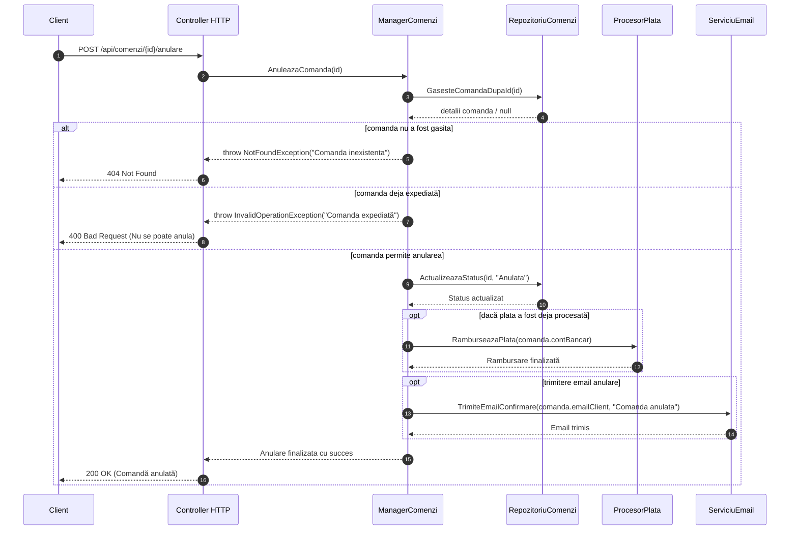

```mermaid
sequenceDiagram
    autonumber
    participant C as Client
    participant API as Controller HTTP
    participant M as ManagerComenzi
    participant R as RepozitoriuComenzi
    participant P as ProcesorPlata
    participant E as ServiciuEmail

    C->>API: POST /api/comenzi/{id}/anulare
    API->>M: AnuleazaComanda(id)
    M->>R: GasesteComandaDupaId(id)
    R-->>M: detalii comanda / null
    alt comanda nu a fost gasita
        M-->>API: throw NotFoundException("Comanda inexistenta")
        API-->>C: 404 Not Found
    else comanda deja expediată
        M-->>API: throw InvalidOperationException("Comanda expediată")
        API-->>C: 400 Bad Request (Nu se poate anula)
    else comanda permite anularea
        M->>R: ActualizeazaStatus(id, "Anulata")
        R-->>M: Status actualizat
        
        opt dacă plata a fost deja procesată
            M->>P: RamburseazaPlata(comanda.contBancar)
            P-->>M: Rambursare finalizată
        end
        
        opt trimitere email anulare
            M->>E: TrimiteEmailConfirmare(comanda.emailClient, "Comanda anulata")
            E-->>M: Email trimis
        end
        
        M-->>API: Anulare finalizata cu succes
        API-->>C: 200 OK (Comandă anulată)
    end
```