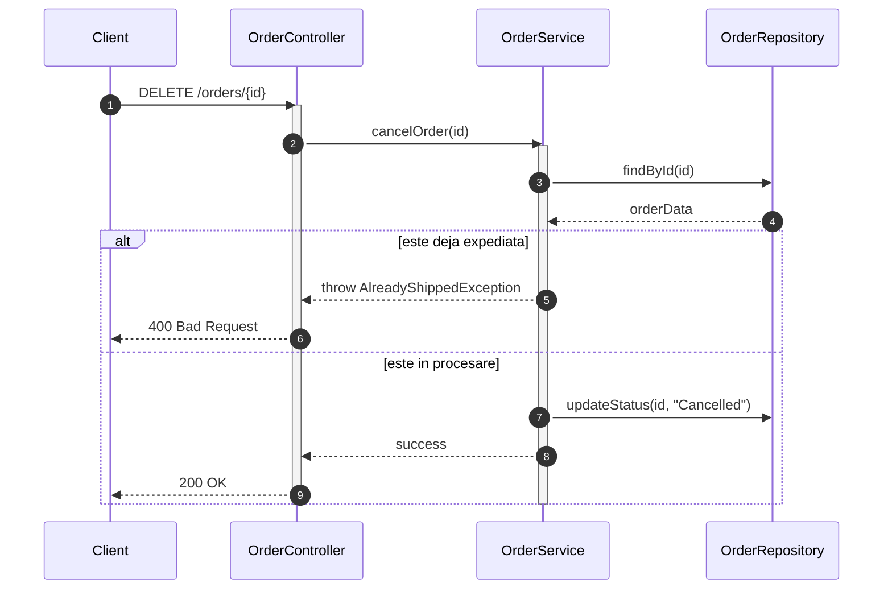

```mermaid

sequenceDiagram
    autonumber
    participant C as Client
    participant Ctrl as OrderController
    participant S as OrderService
    participant R as OrderRepository

    C->>Ctrl: DELETE /orders/{id}
    activate Ctrl

    Ctrl->>S: cancelOrder(id)
    activate S

    S->>R: findById(id)
    R-->>S: orderData
    
    alt este deja expediata
        S-->>Ctrl: throw AlreadyShippedException
        Ctrl-->>C: 400 Bad Request
        
    else este in procesare
        S->>R: updateStatus(id, "Cancelled")
        S-->>Ctrl: success
        Ctrl-->>C: 200 OK
    end
    deactivate S
    deactivate Ctrl

```