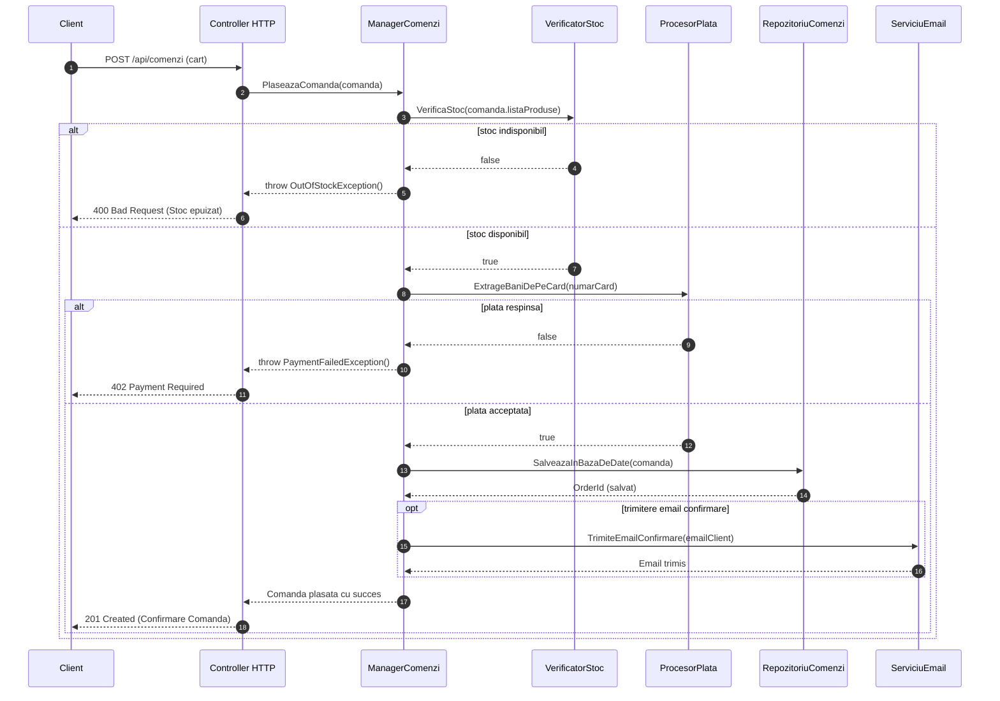

```mermaid
sequenceDiagram
    autonumber
    participant C as Client
    participant API as Controller HTTP
    participant M as ManagerComenzi
    participant S as VerificatorStoc
    participant P as ProcesorPlata
    participant R as RepozitoriuComenzi
    participant E as ServiciuEmail

    C->>API: POST /api/comenzi (cart)
    API->>M: PlaseazaComanda(comanda)
    
    M->>S: VerificaStoc(comanda.listaProduse)
    
    alt stoc indisponibil
        S-->>M: false
        M-->>API: throw OutOfStockException()
        API-->>C: 400 Bad Request (Stoc epuizat)
    else stoc disponibil
        S-->>M: true
        M->>P: ExtrageBaniDePeCard(numarCard)
        
        alt plata respinsa
            P-->>M: false
            M-->>API: throw PaymentFailedException()
            API-->>C: 402 Payment Required
        else plata acceptata
            P-->>M: true
            M->>R: SalveazaInBazaDeDate(comanda)
            R-->>M: OrderId (salvat)
            
            opt trimitere email confirmare
                M->>E: TrimiteEmailConfirmare(emailClient)
                E-->>M: Email trimis
            end
            
            M-->>API: Comanda plasata cu succes
            API-->>C: 201 Created (Confirmare Comanda)
        end
    end
```